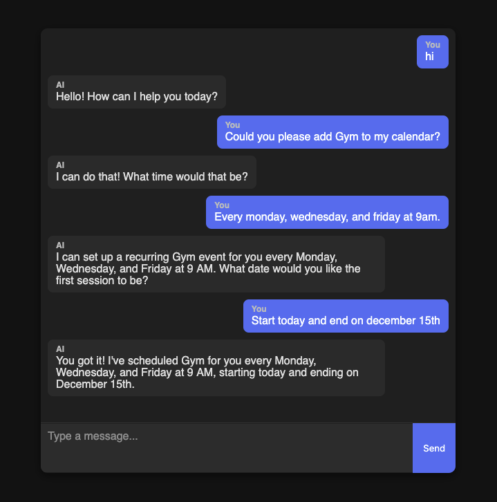

# AutoCal

## AI Agent written in Python to streamline Google Calendar management

This project is a full-stack tool to help users manage their Google Calendar. It is built in Python, using LangGraph for the AI agent and the Google Calendar API to create, retrieve, modify, and delete events. It has a FastAPI backend to communicate with the React frontend, displaying live chat responses from the agent.

## Installation

1. Clone this repository
2. Install python 3.13.6 or later
3. Follow the instructions [here](https://developers.google.com/workspace/calendar/api/quickstart/python) to set up a Google Cloud project, and save the credentials.json file to the root directory
4. Create an account over at [tavily](https://www.tavily.com/) and create an API key
5. Create a Google AI Studio API key [here](https://aistudio.google.com/app/apikey)
6. Install all packages using
```console
pip install -r requirements.txt
```
7. Put your API keys from steps 4 and 5 into a .env file in the root directory like so:
```console
TAVILY_API_KEY=your_tavily_key_here

GOOGLE_AI_KEY=your_google_ai_key_here
```
8. Run the app either from the command line, or through the frontend interface using:
```console
uvicorn src.server:app --reload --port 8000

npm run dev
```

## Screenshots

**Frontend Chat Interface**

