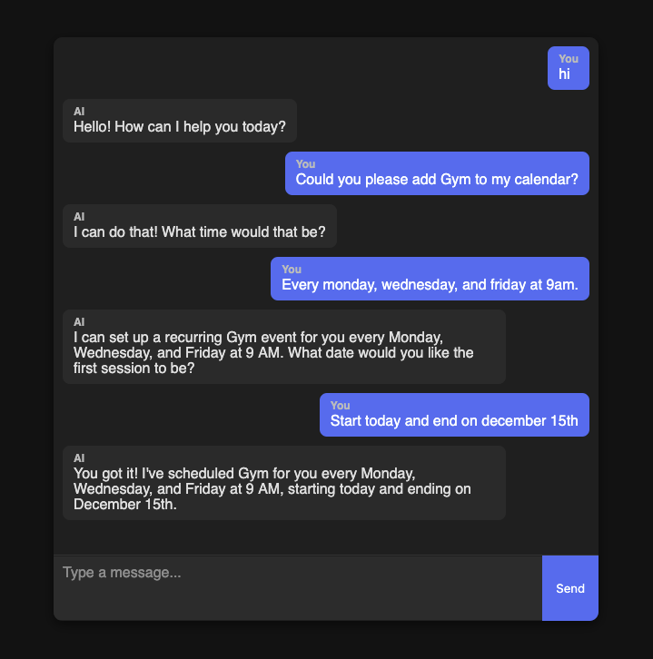

# AutoCal

## AI Agent written in Python to streamline Google Calendar management

This project is a full-stack tool to help users manage their Google Calendar.
It is built in Python on the Claude Agent SDK, using the Google Calendar API to create, retrieve, modify, and delete events.
It has a FastAPI backend to communicate with the React frontend, displaying chat responses from the agent.

## Installation

1. Clone this repository
2. Install python 3.10 or later
3. Follow the instructions [here](https://developers.google.com/workspace/calendar/api/quickstart/python) to set up a Google Cloud project, and save the credentials.json file to the root directory
4. Install all packages using
```console
pip install -r requirements.txt
```
5. Set up authentication for Claude (see below)
6. Run the app either from the command line, or through the frontend interface using:
```console
uvicorn src.server:app --reload --port 8787

npm run dev
```

## Authentication

AutoCal talks to Claude through the [Claude Agent SDK](https://code.claude.com/docs/en/agent-sdk/overview), which picks up whatever Anthropic credentials are present in your environment.

Create an API key in the [Claude Console](https://platform.claude.com/settings/keys) and set it in a .env file in the root directory:
```console
ANTHROPIC_API_KEY=your_key_here
```

Usage is billed per token at standard API rates.
A personal calendar workload typically costs a few cents per day.

## Screenshots

**Frontend Chat Interface**

